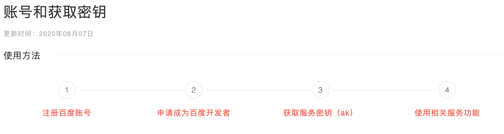

## 一、Echarts收尾

### 1.1 Echarts组件


常用组件：

1.title组件

2.xAxis,yAxis轴组件

3.tooltip提示框组件

4.legend图例组件

5.grid网络组件

6.toolbox工具箱组件

7.定位组件(left,right,top,bottom),绝大多数组件都有这4个属性

### 1.2 基于Echarts开发的第三方vue组件

- 百度开发的基于vue的Echarts

    - vue2中如何使用
    - vue3中如何使用

- 饿了么开发的基于vue的Echarts

    > 只有vue2的封装版本

    具体笔记，参考同目录下的《基于Echarts开发的第三方vue组件笔记》文件笔记

    

## 二、百度地图

### 2.1 国内主流地图平台

- 百度地图
- 高德地图
- 腾讯地图

## 2.2 以百度地图为主具体使用

- [官网](https://lbsyun.baidu.com/index.php?title=jspopularGL)

- 百度地图快速入门

    - 使用百度地图JS api最新版本：JavaScript API GL

        - 度地图JavaScript API GL v1.0是一套由JavaScript语言编写的应用程序接口
        - JavaScript API GL使用了WebGL对地图、覆盖物等进行渲染，支持3D视角展示地图。

    - 获取帐号和ak,参考[这里](https://lbs.baidu.com/index.php?title=jspopularGL/guide/getkey)文档

        

    - 参考[官方案例](https://lbs.baidu.com/index.php?title=jspopularGL/guide/helloworld)完成第一个hello world，完整代码如下：

        ```js
        <!DOCTYPE html>
        <html lang="en">
        
        <head>
            <meta charset="UTF-8">
            <meta http-equiv="X-UA-Compatible" content="IE=edge">
            <meta name="viewport" content="width=device-width, initial-scale=1.0">
            <title>Document</title>
            <style>
                html {
                    height: 100%
                }
                
                body {
                    height: 100%;
                    margin: 0px;
                    padding: 0px
                }
                
                #container {
                    height: 100%
                }
            </style>
        </head>
        
        <body>
            <div id="container"></div>
        </body>
        <script type="text/javascript" src="https://api.map.baidu.com/api?v=1.0&&type=webgl&ak=ZVKjMtNTL0tOh3vqjgMVhr02rwQNzyaL"></script>
        <script>
            //使用Map类实例化
            const map = new BMapGL.Map('container')
        
            //指定地图中心点，通常是一个经纬度
            const point = new BMapGL.Point(121.671125, 31.144737)
        
            //生成百度地图
            map.centerAndZoom(point, 15)
        
            //设置允许滚轮缩放
            map.enableScrollWheelScale()
        </script>
        
        </html>
        ```

        

        

